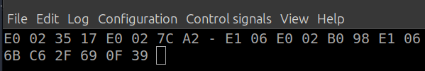

# I2C_Interfacing
This Project is synthesised and implemented on Efinix Efinity software for Trion T120 FPGA board.

This easy to use System Verilog I2C master module allows easy drop in operation into any FPGA project and allows for effective and reliable I2C master operation.

## Clock Divider
This module is designed to utilize the same system clock as the rest of your design. By doing this we can minimize situations where they could be potential inter clock path timing violations. However, in most cases such clocks are in the megahertz range and running I2C transactions at those rates are unrealistic, therefore we need a mechanism to divide our clock down. To do so we will be using a simple counter-based divider. The “divider_counter” is a 16 bit register that is continuously incremented. When it is equal to the “divider” input value, our divider tick wire will pulse high, and the counter will return to zero. This divider tick pulse will signal the main state machine to execute an operation. It is important to still drive the main state machine’s flip flops at the system clock and have the divider tick be a gate keeper with an if statement. Although driving the flip flops using the divider register directly as a clock will look fine in simulation, the implemented design will have erratic behavior because FPGAs typically use dedicated optimized paths for clocks that are different from register paths. The I2C SCL frequency can be calculated using the equation below.

## State Partitioning
Each time our divider tick pulses process counter is incremented (the state executes a process). This is because each state is partitioned into 4 processes (process_counter = 0, 1, 2, 3). SCL is toggled during the middle two processes ( 1 and 2 ). SDA bit data is asserted during process_counter = 0. This allows for a quarter SCL period of setup time.

## Clock Stretching
When process_counter = 1, the SCL line is released and placed in the high Z state. During this time the master checks for any clock stretching being attempted by the slave. If no clock stretching is detected, the master will iterate through the remaining processes and continue as normal. However if clock stretching is detected, the master will stay in the process_counter = 1 process until SCL line is high once more.

## State Diagram

## Input command format for design

- Slave_addr is 7-bit address to select I2C slave.
- RW bit defines the read and write operation. (0 for write)
- Length is defined by total number of bytes to be written or read.
- Data values in the write cycle can be considered as register address or data values. Each data value is of 8-bits.

## Input command format for sensor

## Screenshot of operation

Here the input is command as

1. Wakeup command - E0 02 35 17
2. Measurement command - E0 02 7C A2
3. Reading data Command  - E1 06
4. Sleep Command - E0 02 B0 98

Here we got reading from temperature and humidity sensor as

-> 6D 44 6D 6E FC 46

The firsr 3 bytes are regarding the temperature and the last 3 are regarding humidity.

These values can be converted back to standard values using the following formula

As our input clock is of 50 MHz. So, the value of temperature read by the sensor is 29.693 degree celcius.
